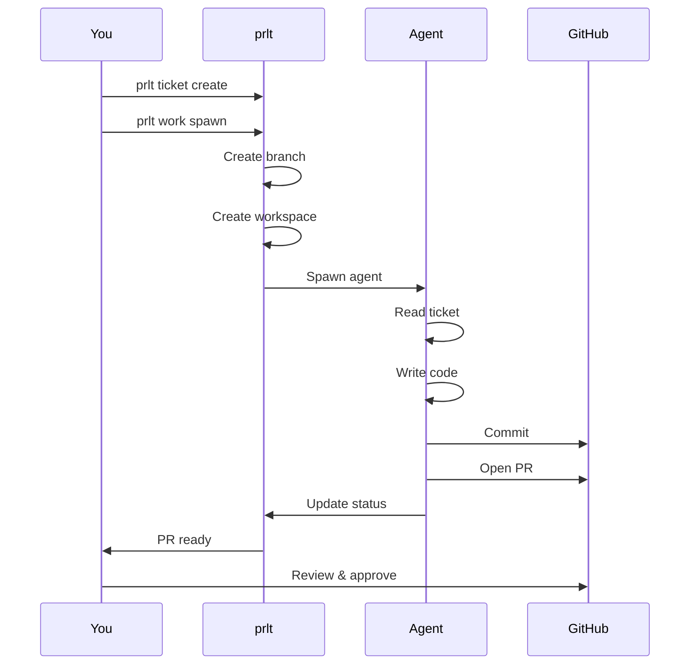
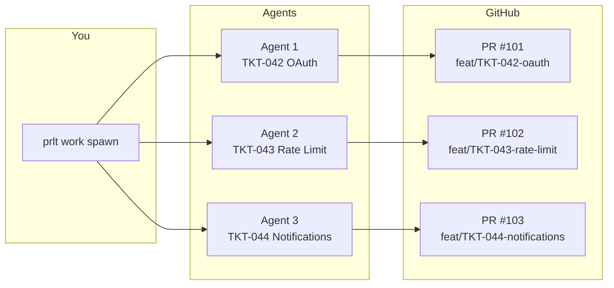

```
██████╗ ██████╗  ██████╗ ██╗     ███████╗████████╗ █████╗ ██████╗ ██╗ █████╗ ████████╗
██╔══██╗██╔══██╗██╔═══██╗██║     ██╔════╝╚══██╔══╝██╔══██╗██╔══██╗██║██╔══██╗╚══██╔══╝
██████╔╝██████╔╝██║   ██║██║     █████╗     ██║   ███████║██████╔╝██║███████║   ██║
██╔═══╝ ██╔══██╗██║   ██║██║     ██╔══╝     ██║   ██╔══██║██╔══██╗██║██╔══██║   ██║
██║     ██║  ██║╚██████╔╝███████╗███████╗   ██║   ██║  ██║██║  ██║██║██║  ██║   ██║
╚═╝     ╚═╝  ╚═╝ ╚═════╝ ╚══════╝╚══════╝   ╚═╝   ╚═╝  ╚═╝╚═╝  ╚═╝╚═╝╚═╝  ╚═╝   ╚═╝
```

### Seize the means of production - Ship 100x.

[](https://www.npmjs.com/package/@proletariat/cli)
[](https://registry.modelcontextprotocol.io)
[](https://opensource.org/licenses/Apache-2.0)

> **Agent orchestration platform for AI labor.** Spin up workers for all work, on demand.
>
> Themed agents, including billionaires - Finally, they work for us.

> ⚠️ **Beta Software** — Under active development. Commands and APIs may change between versions, and bugs are actively being squashed.
>
> **Let's get you shipping** [Book a call][cal-link] - I'm happy to help you get prlt running or chat feedback, ideas, multi-agent workflows, and the future of work/labor (and economic labor theory..)

---

# TLDR

**prlt** is an agent orchestration platform for AI labor. Spin up workers on demand, coordinate multi-agent development from one CLI. Isolated workspaces, secure containers, persistent state.

```bash
brew install chrismcdermut/proletariat/prlt    # macOS (Homebrew)
# or
npm install -g @proletariat/cli        # any platform (npm)

prlt new
prlt ticket create --title "Add OAuth" --category feature
prlt work spawn   # Interactive: select tickets, environment, action
```

Agent spawns in its own branch, writes code, opens PR. You review and merge.

**Why prlt?**

- **Isolated** - Each agent gets its own git branch. No conflicts.
- **Secure** - Docker containers, sandboxed from your host.
- **Durable** - Tmux sessions persist. Close window, agent keeps working.
- **Trackable** - One database, one CLI, all your agents.
- **Ephemeral** - Spawn agents on demand. They work, they PR, they're done.
- **Structured** - Tickets provide structured context, not freeform chat.
- **Persistent** - Tickets accumulate context over time. Hand off between agents.
- **Agent-native** - `--json` mode lets AI agents drive the CLI programmatically.

---

# Quick Start

```bash
brew install chrismcdermut/proletariat/prlt  # Install (Homebrew, recommended)
# or
npm install -g @proletariat/cli              # Install (npm, all platforms)

prlt new                           # Create HQ, add repos, choose theme
prlt ticket create --title "Add OAuth" --category feature
prlt work spawn                    # Interactive: select tickets, environment, action
# Agent creates PR → You review → Merge → Done
```

<details>
<summary><b>Workflow Diagram</b> (click to expand)</summary>



</details>

Spawn agents to implement, groom, or review—not just write code.

### Interactive Menus

`prlt work` guides you through project and ticket selection:

<p align="center">
  
</p>

Choose your operation—start a single agent, batch spawn, or watch a column:

<p align="center">
  
</p>

Select tickets to spawn, grouped by priority:

<p align="center">
  
</p>

---

# Deep Dive

| Problem                                   | Solution                                                                                     |
| ----------------------------------------- | -------------------------------------------------------------------------------------------- |
| Agents conflict with each other's changes | **Isolated** - Each agent gets its own git branch and worktree                               |
| Agents run unsandboxed on your machine    | **Secure** - Docker containers, sandboxed from your host (looking into host sandbox options) |
| You lose track of who's doing what        | **Trackable** - All state in one SQLite database, one CLI                                    |
| Sessions die when you close a window      | **Durable** - Tmux sessions persist, detach/reattach anytime                                 |
| Context scattered across chat windows     | **Structured** - Tickets with requirements, acceptance criteria                              |
| Starting agents is heavyweight            | **Ephemeral** - Spawn on demand, they work, they PR, they're done                            |
| Context lost between agent runs           | **Persistent** - Tickets accumulate context, hand off between agents                         |

### Installation

#### Homebrew (recommended)

```bash
brew install chrismcdermut/proletariat/prlt
```

Works on both Apple Silicon (arm64) and Intel (x86_64) Macs. No compiler needed.

**Upgrade:**

```bash
brew update
brew upgrade prlt
```

#### npm / pnpm (all platforms)

```bash
npm install -g @proletariat/cli
# or
pnpm install -g @proletariat/cli
```

> **pnpm 10+ note:** pnpm 10 blocks native addon build scripts by default. If `prlt` fails with a native module error after install, run `pnpm approve-builds` in the global store and reinstall, or use `npm` / `brew` instead.

**Verify:**

```bash
prlt --version
```

### MCP Server

prlt includes a built-in MCP server with 100+ tools. Add it to your AI client:

**Claude Code** (`~/.claude.json`):
```json
{
  "mcpServers": {
    "prlt": { "command": "prlt", "args": ["mcp-server"] }
  }
}
```

**Cursor / Other clients** (via npx):
```json
{
  "mcpServers": {
    "prlt": { "command": "npx", "args": ["-y", "@proletariat/cli", "mcp-server"] }
  }
}
```

Listed on: [MCP Registry](https://registry.modelcontextprotocol.io) | [npm](https://www.npmjs.com/package/@proletariat/cli)

### Data Model

```
Workspace (HQ)
├── Projects
│   ├── Epics → Tickets
│   └── (references a Workflow)
├── Workflows → Phases → Statuses (can be shared across projects)
├── Specs (can span projects)
├── Actions (reusable templates)
├── Agents
│   ├── Staff (persistent, named)
│   └── Temp (ephemeral, per-ticket)
└── Executions (running sessions)
    ├── Docker
    │   ├── Tmux session
    │   ├── Terminal or Background display
    │   └── Safe or YOLO permissions
    └── Host
        ├── Tmux session
        ├── Terminal or Background display
        └── Safe or YOLO permissions
```

| Entity            | Description                                                    |
| ----------------- | -------------------------------------------------------------- |
| **Project**       | Groups tickets and epics, references a workflow                |
| **Epic**          | Work container with lifecycle (draft → active → complete)      |
| **Ticket**        | Individual work item with requirements and acceptance criteria |
| **Spec**          | Static documentation (can span projects, linked to epics)      |
| **Workflow**      | Status flow configuration (can be shared across projects)      |
| **Phase**         | Stage in a workflow                                            |
| **Status**        | Ticket state within a phase                                    |
| **Action**        | Reusable prompt/action templates                               |
| **Agent (Staff)** | Persistent named agent with dedicated workspace                |
| **Agent (Temp)**  | Ephemeral agent spawned for a single ticket                    |
| **Execution**     | Running agent session on a ticket                              |
| **Display**       | Terminal (new tab) or Background (detached)                    |

### Example Workflow

A workflow defines how tickets move through your process. Projects reference a workflow, and multiple projects can share the same one.

```
Kanban Workflow
├── Backlog       # New tickets land here
├── In Progress   # Agent working (prlt work spawn)
├── Review        # PR ready (prlt work ready)
└── Done          # Merged (prlt work complete)
```

```
Scrum Workflow
├── Backlog
├── Sprint
│   ├── To Do
│   ├── In Progress
│   └── In Review
└── Done
```

Tickets flow through statuses as work progresses. Agents automatically move tickets when they start work, open PRs, or complete tasks.

### Workspace Structure

Each agent gets a copy of all repos (repo scoping coming soon). Work happens on isolated branches.

```
my-project/
├── .proletariat/
│   └── workspace.db              # Tickets, executions, state
├── repos/
│   ├── frontend/                 # Your repos
│   ├── backend/
│   └── infra/
└── agents/
    ├── staff/
    │   └── alice/                # Named agent with persistent workspace
    │       ├── frontend/
    │       ├── backend/
    │       └── infra/
    └── temp/
        ├── agent-abc123/         # Ephemeral: Working on TKT-042 (OAuth)
        │   ├── frontend/         # All repos on branch: feat/TKT-042-oauth
        │   ├── backend/
        │   └── infra/
        └── agent-def456/         # Ephemeral: Working on TKT-043 (API)
            ├── frontend/         # All repos on branch: feat/TKT-043-api
            ├── backend/
            └── infra/
```

### Agent Naming Themes

Themes control how agents are named. Staff agents use theme names directly (e.g., `bezos`, `camry`). Ephemeral agents add an adjective prefix (e.g., `bold-bezos`, `keen-camry`). Currently ephemeral names also include a number suffix (`bold-bezos-1`), but this will be removed soon.

**Built-in Themes:**

| Theme          | Description                          | Example Names                |
| -------------- | ------------------------------------ | ---------------------------- |
| `billionaires` | Tech founders & executives (default) | `musk`, `gates`, `bezos`     |
| `toyotas`      | Toyota vehicle models                | `camry`, `supra`, `tacoma`   |
| `companies`    | Major tech companies                 | `stripe`, `vercel`, `linear` |

> _billionaires_ — Finally, they work for us.

**Theme Commands:**

```bash
prlt agent themes list              # List available themes
prlt agent themes set billionaires  # Set active theme
prlt agent themes create mytheme    # Create custom theme
prlt agent themes add-names mytheme # Add names to custom theme
```

Themes are selected during `prlt new`.

### Three Ways to Use Commands

#### 1. Interactive (Humans)

Run without flags—get guided prompts:

```bash
$ prlt ticket create

? Title: Add password reset
? Description: Email-based password reset flow
? Priority: P1
? Category: feature

✓ Created TKT-043
```

View ticket details with `prlt ticket`:

<p align="center">
  
</p>

#### 2. JSON Mode (AI Agents)

Add `--json` for machine-readable output:

```bash
$ prlt work start --json
```

```json
{
  "prompt": {
    "type": "list",
    "message": "Select ticket to work on:",
    "choices": [
      {
        "name": "[P1] TKT-042 - Add user authentication",
        "value": "TKT-042",
        "command": "prlt work start TKT-042 --json"
      }
    ]
  }
}
```

AI agents parse this, make selections, call the next command.

#### 3. Flags (Scripts/CI)

Pass everything directly:

```bash
prlt ticket create \
  --title "Add OAuth" \
  --description "Google and GitHub OAuth" \
  --priority P1 \
  --category feature
```

### Execution Modes

**Environment** - where the agent runs:

| Environment | Flag                             | Best For                        |
| ----------- | -------------------------------- | ------------------------------- |
| 🐳 Docker   | (default if devcontainer exists) | Safety—fully isolated container |
| 🏃 Host     | `--run-on-host`                  | Speed—no container overhead     |

**Display** - how you see it:

| Display       | Flag                   | Best For                  |
| ------------- | ---------------------- | ------------------------- |
| 📺 Terminal   | `--display terminal`   | Watch in new terminal tab |
| 🔇 Background | `--display background` | Detached, reattach later  |

**Permissions** - agent access level:

| Mode    | Flag                 | Description                                                 |
| ------- | -------------------- | ----------------------------------------------------------- |
| 🔒 Safe | (default)            | Agent prompts for permissions                               |
| 🕺 YOLO | `--skip-permissions` | No prompts, full access. Use with Docker for safe autonomy. |

All sessions run in tmux under the hood—close the window, agent keeps working.

```bash
# Default: Docker + terminal (if devcontainer exists)
prlt work start TKT-042

# Docker + background
prlt work start TKT-042 --display background

# Host + background (fast, no container)
prlt work start TKT-042 --run-on-host --display background

# Docker + YOLO (full autonomy, safely sandboxed)
prlt work start TKT-042 --skip-permissions
```

### Parallel Agents

Work on multiple tickets simultaneously.

**Interactive (humans):**

```bash
$ prlt work spawn

? Spawn mode: Select specific tickets
? Select tickets:
  ◉ [P1] TKT-042 - Add user authentication
  ◉ [P1] TKT-043 - Add API rate limiting
  ◯ [P2] TKT-044 - Add email notifications
? Action: implement
? Environment: docker

Spawning 2 tickets...
```

**JSON mode (AI agents):** _(multi-select WIP)_

```bash
$ prlt work spawn --json --many
```

```json
{
  "prompt": {
    "type": "checkbox",
    "message": "Select tickets to spawn:",
    "choices": [
      {"name": "[P1] TKT-042 - Add user authentication", "value": "TKT-042"},
      {"name": "[P1] TKT-043 - Add API rate limiting", "value": "TKT-043"}
    ]
  }
}
```

**Flags (scripts/CI):**

```bash
prlt work spawn TKT-042 TKT-043 --action implement --mode docker
```

Each agent works in its own branch. No conflicts.

> **Scaling:** The main limit is your machine. 50+ concurrent agents is achievable—depends on CPU, RAM, and whether you're running Docker or host mode.

Monitor running agents with `prlt execution`:

<p align="center">
  
</p>



Agent-created PRs ready for review:

<p align="center">
  
</p>

### Command Reference

<details>
<summary><b>Full Command Reference</b> (click to expand)</summary>

<table>
  <tr><th>Namespace</th><th>Command</th><th>Description</th></tr>
  <!-- ticket -->
  <tr><td rowspan="10"><b>ticket</b></td><td><code>prlt ticket create</code></td><td>Create new ticket</td></tr>
  <tr><td><code>prlt ticket list</code></td><td>List all tickets</td></tr>
  <tr><td><code>prlt ticket view <id></code></td><td>View ticket details</td></tr>
  <tr><td><code>prlt ticket edit <id></code></td><td>Edit ticket</td></tr>
  <tr><td><code>prlt ticket move <id> <status></code></td><td>Change status</td></tr>
  <tr><td><code>prlt ticket delete <id></code></td><td>Delete ticket</td></tr>
  <tr><td><code>prlt ticket complete <id></code></td><td>Mark ticket complete</td></tr>
  <tr><td><code>prlt ticket bulk</code></td><td>Bulk ticket operations</td></tr>
  <tr><td><code>prlt ticket link block <id></code></td><td>Link blocking ticket</td></tr>
  <tr><td><code>prlt ticket link relates <id></code></td><td>Link related ticket</td></tr>
  <!-- work -->
  <tr><td rowspan="11"><b>work</b></td><td><code>prlt work start <id></code></td><td>Spawn agent on ticket</td></tr>
  <tr><td><code>prlt work groom <id></code></td><td>Enrich ticket with requirements and AC</td></tr>
  <tr><td><code>prlt work resolve <id></code></td><td>Resolve ambiguity questions on a ticket</td></tr>
  <tr><td><code>prlt work implement <id></code></td><td>Spawn agent to implement a ticket</td></tr>
  <tr><td><code>prlt work review <id></code></td><td>Spawn agent to review a ticket's PR</td></tr>
  <tr><td><code>prlt work peek <id></code></td><td>Check agent status and progress</td></tr>
  <tr><td><code>prlt work poke <id></code></td><td>Send a message to steer an agent</td></tr>
  <tr><td><code>prlt work stop <id></code></td><td>Stop a running agent</td></tr>
  <tr><td><code>prlt work spawn</code></td><td>Batch spawn tickets</td></tr>
  <tr><td><code>prlt work ready <id></code></td><td>Mark ready for review</td></tr>
  <tr><td><code>prlt work watch</code></td><td>Watch work progress</td></tr>
  <!-- execution -->
  <tr><td rowspan="3"><b>execution</b></td><td><code>prlt execution list</code></td><td>List running agents</td></tr>
  <tr><td><code>prlt execution logs <id></code></td><td>View agent output</td></tr>
  <tr><td><code>prlt execution stop <id></code></td><td>Stop an agent</td></tr>
  <!-- agent -->
  <tr><td rowspan="11"><b>agent</b></td><td><code>prlt agent list</code></td><td>List all agents</td></tr>
  <tr><td><code>prlt agent status <name></code></td><td>Check agent status</td></tr>
  <tr><td><code>prlt agent shell <name></code></td><td>Shell into agent workspace</td></tr>
  <tr><td><code>prlt agent visit <name></code></td><td>Navigate to workspace</td></tr>
  <tr><td><code>prlt agent login <name></code></td><td>Auth Claude in container</td></tr>
  <tr><td><code>prlt agent rebuild <name></code></td><td>Rebuild agent workspace</td></tr>
  <tr><td><code>prlt agent restart <name></code></td><td>Restart agent</td></tr>
  <tr><td><code>prlt agent staff add <names></code></td><td>Add named agents</td></tr>
  <tr><td><code>prlt agent staff list</code></td><td>List staff agents</td></tr>
  <tr><td><code>prlt agent temp list</code></td><td>List ephemeral agents</td></tr>
  <tr><td><code>prlt agent temp cleanup</code></td><td>Remove ephemeral agents</td></tr>
  <!-- agent themes -->
  <tr><td rowspan="4"><b>agent themes</b></td><td><code>prlt agent themes list</code></td><td>List available themes</td></tr>
  <tr><td><code>prlt agent themes set <name></code></td><td>Set active theme</td></tr>
  <tr><td><code>prlt agent themes create <name></code></td><td>Create custom theme</td></tr>
  <tr><td><code>prlt agent themes add-names</code></td><td>Add names to theme</td></tr>
  <!-- board -->
  <tr><td rowspan="2"><b>board</b></td><td><code>prlt board</code></td><td>View kanban board</td></tr>
  <tr><td><code>prlt board watch</code></td><td>Real-time updates</td></tr>
  <!-- project -->
  <tr><td rowspan="6"><b>project</b></td><td><code>prlt project create</code></td><td>Create project</td></tr>
  <tr><td><code>prlt project list</code></td><td>List projects</td></tr>
  <tr><td><code>prlt project view <id></code></td><td>View project details</td></tr>
  <tr><td><code>prlt project archive <id></code></td><td>Archive project</td></tr>
  <tr><td><code>prlt project unarchive <id></code></td><td>Unarchive project</td></tr>
  <tr><td><code>prlt project delete <id></code></td><td>Delete project</td></tr>
  <!-- action -->
  <tr><td rowspan="6"><b>action</b></td><td><code>prlt action create</code></td><td>Create action template</td></tr>
  <tr><td><code>prlt action list</code></td><td>List actions</td></tr>
  <tr><td><code>prlt action show <id></code></td><td>Show action details</td></tr>
  <tr><td><code>prlt action run <id></code></td><td>Run action</td></tr>
  <tr><td><code>prlt action update <id></code></td><td>Update action</td></tr>
  <tr><td><code>prlt action delete <id></code></td><td>Delete action</td></tr>
  <!-- branch -->
  <tr><td rowspan="3"><b>branch</b></td><td><code>prlt branch create</code></td><td>Create branch</td></tr>
  <tr><td><code>prlt branch list</code></td><td>List branches</td></tr>
  <tr><td><code>prlt branch validate</code></td><td>Validate branch name</td></tr>
  <!-- pr -->
  <tr><td rowspan="3"><b>pr</b></td><td><code>prlt pr create</code></td><td>Create pull request</td></tr>
  <tr><td><code>prlt pr status <id></code></td><td>Check PR status</td></tr>
  <tr><td><code>prlt pr link <id> <url></code></td><td>Link PR to ticket</td></tr>
  <!-- gh -->
  <tr><td rowspan="3"><b>gh</b></td><td><code>prlt gh login</code></td><td>Login to GitHub</td></tr>
  <tr><td><code>prlt gh status</code></td><td>Check auth status</td></tr>
  <tr><td><code>prlt gh token</code></td><td>Get GitHub token</td></tr>
  <!-- repo -->
  <tr><td rowspan="4"><b>repo</b></td><td><code>prlt repo add <url></code></td><td>Add repository</td></tr>
  <tr><td><code>prlt repo list</code></td><td>List repositories</td></tr>
  <tr><td><code>prlt repo view <name></code></td><td>View repository details</td></tr>
  <tr><td><code>prlt repo remove <name></code></td><td>Remove repository</td></tr>
  <!-- docker -->
  <tr><td rowspan="10"><b>docker</b></td><td><code>prlt docker list</code></td><td>List containers</td></tr>
  <tr><td><code>prlt docker status</code></td><td>Check Docker status</td></tr>
  <tr><td><code>prlt docker start <name></code></td><td>Start container</td></tr>
  <tr><td><code>prlt docker stop <name></code></td><td>Stop container</td></tr>
  <tr><td><code>prlt docker restart <name></code></td><td>Restart container</td></tr>
  <tr><td><code>prlt docker logs <name></code></td><td>View container logs</td></tr>
  <tr><td><code>prlt docker shell <name></code></td><td>Shell into container</td></tr>
  <tr><td><code>prlt docker sync <name></code></td><td>Sync container files</td></tr>
  <tr><td><code>prlt docker clean</code></td><td>Remove stopped containers</td></tr>
  <tr><td><code>prlt docker prune</code></td><td>Remove unused resources</td></tr>
  <!-- session -->
  <tr><td rowspan="2"><b>session</b></td><td><code>prlt session list</code></td><td>List active tmux sessions</td></tr>
  <tr><td><code>prlt session attach <name></code></td><td>Attach to tmux session</td></tr>
  <!-- workspace -->
  <tr><td rowspan="5"><b>workspace</b></td><td><code>prlt init</code></td><td>Initialize machine config</td></tr>
  <tr><td><code>prlt new</code></td><td>Create new HQ workspace</td></tr>
  <tr><td><code>prlt workspace list</code></td><td>List workspaces</td></tr>
  <tr><td><code>prlt workspace add</code></td><td>Add workspace</td></tr>
  <tr><td><code>prlt workspace use <name></code></td><td>Switch workspace</td></tr>
  <!-- utility -->
  <tr><td rowspan="4"><b>utility</b></td><td><code>prlt whoami</code></td><td>Show current context</td></tr>
  <tr><td><code>prlt claude</code></td><td>Quick ad-hoc Claude session</td></tr>
  <tr><td><code>prlt commit</code></td><td>Conventional commit</td></tr>
  <tr><td><code>prlt autocomplete setup</code></td><td>Setup shell autocomplete</td></tr>
</table>

</details>

Run `prlt <command> --help` for flags and options.

### Use Cases

#### Parallel Feature Development

```bash
# Create tickets for each feature
prlt ticket create --title "Add OAuth" --category feature
prlt ticket create --title "Add API rate limiting" --category feature
prlt ticket create --title "Add email notifications" --category feature

# Spawn all three in parallel (Docker for isolation)
prlt work spawn TKT-001 TKT-002 TKT-003 --mode docker

# Watch the board as they work
prlt board watch
```

Three agents, three branches, three PRs. You review and merge.

#### Bug Bash

```bash
# Spawn all bugs at once
prlt work spawn --all --column Backlog --category bug

# Or pick specific ones
prlt work spawn TKT-010 TKT-011 TKT-012
```

#### Grooming Session

Have an agent refine ticket requirements:

```bash
prlt work start TKT-042 --action groom
```

Agent adds acceptance criteria, subtasks, estimates.

---

## Environment Variables

| Variable       | Purpose                       |
| -------------- | ----------------------------- |
| `GITHUB_TOKEN` | GitHub operations (PRs, etc.) |

Claude Code handles its own authentication via `claude login`.

---

## Requirements

- **Node.js 20+** (22 LTS recommended)
- **Git**
- **Claude Code** (`claude login` to authenticate)
- **SQLite**
- **Tmux** (session persistence)
- **Docker** (optional—for isolated execution)

---

## Troubleshooting Installation

### `bun install` fails on better-sqlite3

**Symptom**: `bun install -g @proletariat/cli` fails with `isexe` or `node-gyp` errors during the `better-sqlite3` native module build.

**Cause**: Bun's node-gyp compatibility is limited. The `which` dependency inside node-gyp uses `isexe`, which is incompatible with Bun's runtime shims.

**Fix**: Use `npm` or Homebrew instead:

```bash
# Option 1: Homebrew (macOS, recommended)
brew install chrismcdermut/proletariat/prlt

# Option 2: npm (all platforms)
npm install -g @proletariat/cli

# Option 3: pnpm
pnpm install -g @proletariat/cli
```

If you must use Bun, ensure Node.js 22 (LTS) is also installed and set `better-sqlite3` to use its prebuilt binaries:

```bash
npm rebuild better-sqlite3
```

### npm `EACCES: permission denied`

**Symptom**: `npm install -g @proletariat/cli` fails with `EACCES: permission denied` on `/opt/homebrew/lib/node_modules` or `/usr/local/lib/node_modules`.

**Fix**: Configure npm to use a user-writable directory:

```bash
mkdir -p ~/.npm-global
npm config set prefix '~/.npm-global'
export PATH="$HOME/.npm-global/bin:$PATH"
# Add the export line to your ~/.zshrc or ~/.bashrc
npm install -g @proletariat/cli
```

Or use Homebrew instead (macOS):

```bash
brew install chrismcdermut/proletariat/prlt
```

### Native module errors after install

**Symptom**: `prlt` runs but crashes with `better_sqlite3.node` or ABI mismatch errors.

**Fix**:

```bash
# Rebuild for the current Node version
npm rebuild better-sqlite3

# Verify it works
node -e "require('better-sqlite3')"

# If still failing, reinstall
npm install -g @proletariat/cli --force
```

See the [full troubleshooting guide](../../docs/troubleshooting.md) for more details.

---

## Support

- **Discord**: [discord.gg/tmZyjNNSvw](https://discord.gg/tmZyjNNSvw)
- **GitHub Issues**: [Report bugs or request features](https://github.com/chrismcdermut/proletariat/issues)
- **Setup Help**: [Book a call][cal-link] - I'll help you get things running

---

## License

Apache 2.0

---

[](https://www.npmjs.com/package/@proletariat/cli)
[](https://www.npmjs.com/package/@proletariat/cli)
[](LICENSE)

[Star on GitHub](https://github.com/chrismcdermut/proletariat) | [Install from NPM](https://www.npmjs.com/package/@proletariat/cli) | [Report Issues](https://github.com/chrismcdermut/proletariat/issues)

Made with ⚒️ by the proletariat.

[cal-link]: https://cal.com/chrismcdermut
