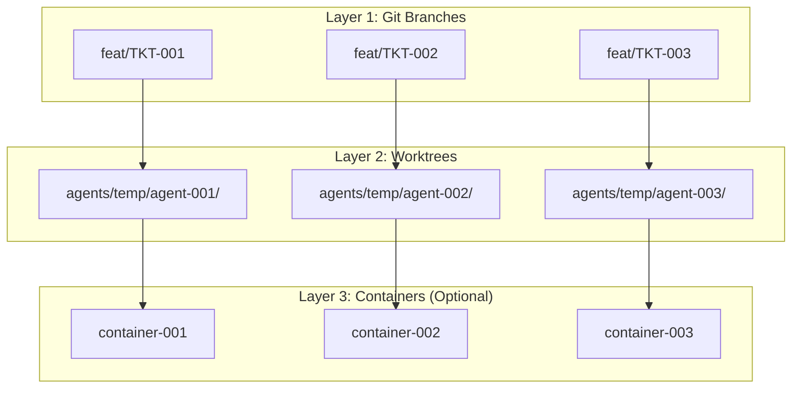
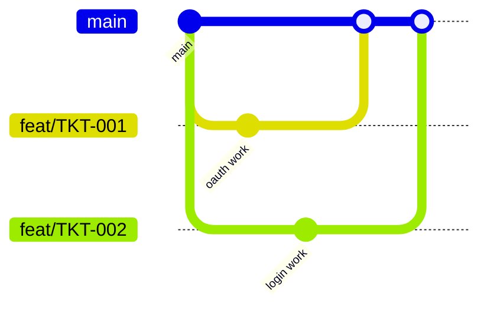
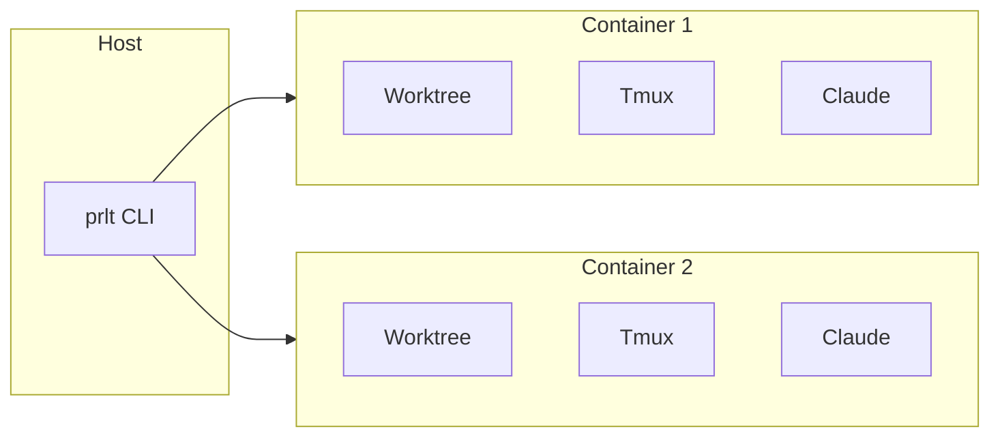
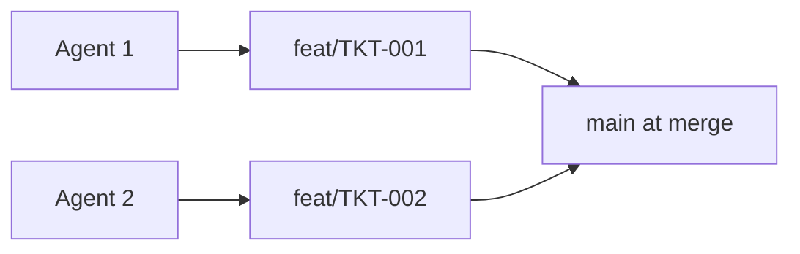

# Agent Isolation

How prlt keeps agents from interfering with each other.

## Isolation Layers

prlt provides multiple layers of isolation:



## Layer 1: Git Branches

Each ticket gets its own branch:

```bash
# Agent 1 works on:
feat/TKT-001-add-oauth

# Agent 2 works on:
feat/TKT-002-fix-login

# No conflicts during development
```

### Branch Naming

```
<type>/TKT-<id>-<slug>

feat/TKT-001-add-oauth
fix/TKT-002-login-bug
refactor/TKT-003-cleanup-auth
```

### Merge Strategy

Agents work independently, conflicts handled at PR merge:



## Layer 2: Git Worktrees

Each agent gets its own filesystem:

```
agents/
├── temp/
│   ├── agent-abc123/     # Agent 1's workspace
│   │   ├── frontend/     # Full repo copy
│   │   ├── backend/      # On branch feat/TKT-001
│   │   └── infra/
│   └── agent-def456/     # Agent 2's workspace
│       ├── frontend/     # Full repo copy
│       ├── backend/      # On branch feat/TKT-002
│       └── infra/
```

### Benefits

- Agents can't overwrite each other's files
- Each agent has complete repo access
- No file locking issues
- Independent npm/pip installs

### Worktree Commands

```bash
# Git manages worktrees
git worktree list
git worktree add agents/temp/agent-001 feat/TKT-001
git worktree remove agents/temp/agent-001
```

## Layer 3: Docker Containers

Optional but recommended for full isolation:



### Container Isolation

Each container:
- Has its own filesystem namespace
- Has its own network namespace
- Has resource limits (CPU, memory)
- Can't access host directly

### YOLO Mode Safety

With Docker, YOLO mode is safe:

```bash
# Agent has full permissions inside container
# But can't affect host system
prlt work start TKT-001 --skip-permissions
```

## Tmux Sessions

Each agent runs in its own tmux session:

```bash
$ tmux list-sessions
prlt-bold-bezos: 1 windows
prlt-keen-gates: 1 windows
prlt-swift-musk: 1 windows
```

### Session Isolation

- Separate terminal environments
- Independent command history
- No stdin/stdout mixing
- Persist after disconnect

## Resource Isolation

### CPU/Memory

Docker provides resource limits:

```json
{
  "runArgs": [
    "--memory=4g",
    "--cpus=2"
  ]
}
```

### Disk Space

Worktrees share git objects but have separate working directories:

```
# Efficient disk usage
.git/objects/    # Shared between all worktrees
agents/agent-1/  # Working files only
agents/agent-2/  # Working files only
```

## Network Isolation

### Docker Mode

Each container has isolated network:

```json
{
  "runArgs": [
    "--network=bridge"
  ]
}
```

### Host Mode

Agents share host network - be careful with port conflicts.

## State Isolation

### Database

Single shared database, but:
- Each ticket has one active execution
- Executions reference specific agents
- Agents reference specific worktrees

### Environment Variables

Each execution environment is separate:

```bash
# Agent 1's container
TICKET_ID=TKT-001
AGENT_NAME=bold-bezos

# Agent 2's container
TICKET_ID=TKT-002
AGENT_NAME=keen-gates
```

## Conflict Prevention

### Same Ticket

Only one agent can work on a ticket at a time:

```bash
$ prlt work start TKT-001
Error: TKT-001 already has an active execution
```

### Same Files

Different branches prevent conflicts during work:



### Merge Conflicts

Handled at PR time:
1. First PR merges cleanly
2. Second PR may need conflict resolution
3. GitHub shows conflicts
4. Manual or agent-assisted resolution

## Best Practices

### Use Docker

```bash
# Always prefer Docker for production use
prlt work spawn TKT-001 --mode docker
```

### Separate Concerns

Assign independent tickets to parallel agents:

```bash
# Good - different areas
prlt work spawn TKT-001  # Frontend feature
prlt work spawn TKT-002  # Backend API
prlt work spawn TKT-003  # Docs update

# Risky - same files
prlt work spawn TKT-001  # Auth frontend
prlt work spawn TKT-002  # Auth frontend refactor
```

### Clean Up

Regular cleanup prevents disk exhaustion:

```bash
prlt agent cleanup
prlt docker prune
```

## Security Considerations

### Docker Mode

- Container filesystem isolated
- No direct host access
- Safe for autonomous operation

### Host Mode

- Full filesystem access
- Use Safe permission mode
- Monitor agent activity

### Credentials

Mount only necessary credentials:

```json
{
  "mounts": [
    "source=${localEnv:HOME}/.claude,target=/home/node/.claude,type=bind"
  ]
}
```

## Next Steps

- [Docker Setup](/guides/docker-setup) - Container configuration
- [How It Works](/architecture/how-it-works) - System overview
- [Multi-Agent Workflows](/guides/multi-agent-workflows) - Parallel agents
