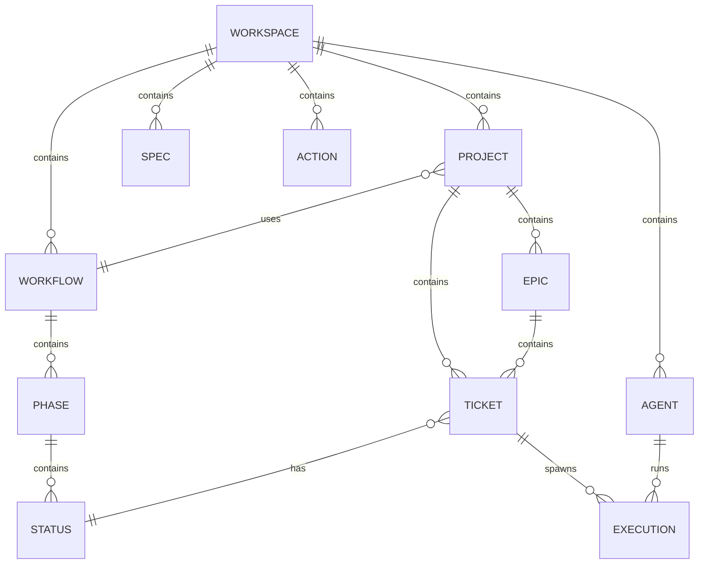

# Data Model

prlt uses SQLite for all state management. Here's the data model.

## Entity Diagram



## Core Entities

### Workspace

The root entity. One database = one workspace.

| Field | Type | Description |
|-------|------|-------------|
| id | TEXT | Unique identifier |
| name | TEXT | Workspace name |
| path | TEXT | Filesystem path |
| theme | TEXT | Agent naming theme |
| created_at | DATETIME | Creation timestamp |

### Project

Groups tickets and references a workflow.

| Field | Type | Description |
|-------|------|-------------|
| id | TEXT | Project ID (PRJ-XXX) |
| name | TEXT | Project name |
| description | TEXT | Project description |
| workflow_id | TEXT | Associated workflow |
| archived | BOOLEAN | Archive status |
| created_at | DATETIME | Creation timestamp |

### Epic

Container for related tickets with lifecycle.

| Field | Type | Description |
|-------|------|-------------|
| id | TEXT | Epic ID (EPC-XXX) |
| title | TEXT | Epic title |
| description | TEXT | Epic description |
| project_id | TEXT | Parent project |
| status | TEXT | draft, active, complete |
| order | INTEGER | Display order |
| created_at | DATETIME | Creation timestamp |

### Ticket

The unit of work.

| Field | Type | Description |
|-------|------|-------------|
| id | TEXT | Ticket ID (TKT-XXX) |
| title | TEXT | Ticket title |
| description | TEXT | Full description |
| priority | TEXT | P0-P4 |
| category | TEXT | feature, bug, etc. |
| status_id | TEXT | Current status |
| project_id | TEXT | Parent project |
| epic_id | TEXT | Optional parent epic |
| acceptance_criteria | JSON | List of AC |
| created_at | DATETIME | Creation timestamp |
| updated_at | DATETIME | Last update |

### Workflow

Defines status flow for tickets.

| Field | Type | Description |
|-------|------|-------------|
| id | TEXT | Workflow ID |
| name | TEXT | Workflow name |
| description | TEXT | Description |
| is_default | BOOLEAN | Default workflow |
| created_at | DATETIME | Creation timestamp |

### Phase

Major stage in a workflow.

| Field | Type | Description |
|-------|------|-------------|
| id | TEXT | Phase ID |
| name | TEXT | Phase name |
| workflow_id | TEXT | Parent workflow |
| order | INTEGER | Display order |
| category | TEXT | backlog, active, complete |

### Status

Ticket state within a phase.

| Field | Type | Description |
|-------|------|-------------|
| id | TEXT | Status ID |
| name | TEXT | Status name |
| phase_id | TEXT | Parent phase |
| order | INTEGER | Display order |
| is_initial | BOOLEAN | Starting status |
| is_final | BOOLEAN | Completion status |

### Agent

AI coding agent.

| Field | Type | Description |
|-------|------|-------------|
| id | TEXT | Agent ID |
| name | TEXT | Agent name |
| type | TEXT | staff or temp |
| status | TEXT | available, working |
| workspace_path | TEXT | Agent workspace path |
| created_at | DATETIME | Creation timestamp |

### Execution

Running agent session.

| Field | Type | Description |
|-------|------|-------------|
| id | TEXT | Execution ID |
| agent_id | TEXT | Running agent |
| ticket_id | TEXT | Ticket being worked |
| action | TEXT | implement, groom, review |
| status | TEXT | running, completed, failed |
| environment | TEXT | docker, host |
| display | TEXT | terminal, background |
| tmux_session | TEXT | Tmux session name |
| started_at | DATETIME | Start time |
| completed_at | DATETIME | End time |

### Spec

Static documentation.

| Field | Type | Description |
|-------|------|-------------|
| id | TEXT | Spec ID (SPC-XXX) |
| title | TEXT | Spec title |
| content | TEXT | Markdown content |
| type | TEXT | technical, design, etc. |
| created_at | DATETIME | Creation timestamp |
| updated_at | DATETIME | Last update |

### Action

Reusable prompt template.

| Field | Type | Description |
|-------|------|-------------|
| id | TEXT | Action ID |
| name | TEXT | Action name |
| description | TEXT | What it does |
| prompt | TEXT | Prompt template |
| is_builtin | BOOLEAN | Built-in action |
| created_at | DATETIME | Creation timestamp |

## Relationships

### Ticket Links

Tickets can be linked:

| Link Type | Description |
|-----------|-------------|
| blocks | This ticket blocks another |
| relates_to | Related tickets |
| duplicates | Duplicate tickets |

```sql
CREATE TABLE ticket_links (
    source_id TEXT,
    target_id TEXT,
    link_type TEXT,
    PRIMARY KEY (source_id, target_id, link_type)
);
```

### Repo Assignments

Repos associated with workspace:

```sql
CREATE TABLE repos (
    id TEXT PRIMARY KEY,
    name TEXT,
    url TEXT,
    path TEXT,
    created_at DATETIME
);
```

## Default Workflow

The default Kanban workflow:

```
Backlog (backlog phase)
├── To Do

Active (active phase)
├── In Progress
├── In Review

Complete (complete phase)
├── Done
```

## ID Patterns

| Entity | Pattern | Example |
|--------|---------|---------|
| Ticket | TKT-XXX | TKT-001 |
| Project | PRJ-XXX | PRJ-001 |
| Epic | EPC-XXX | EPC-001 |
| Spec | SPC-XXX | SPC-001 |

## Database Location

```
.proletariat/workspace.db
```

Access directly (read-only recommended):

```bash
sqlite3 .proletariat/workspace.db

.tables
SELECT * FROM tickets;
```

## Migrations

Schema changes are handled automatically on CLI updates.

## Next Steps

- [Agent Isolation](/architecture/agent-isolation) - How agents are isolated
- [How It Works](/architecture/how-it-works) - System overview
