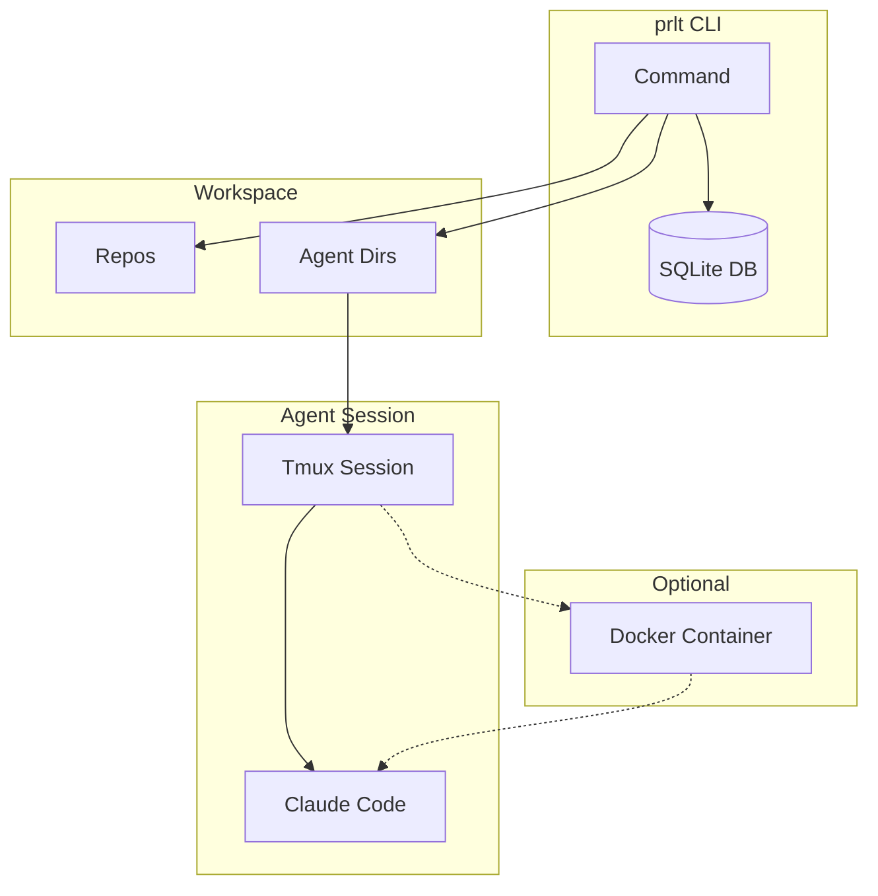
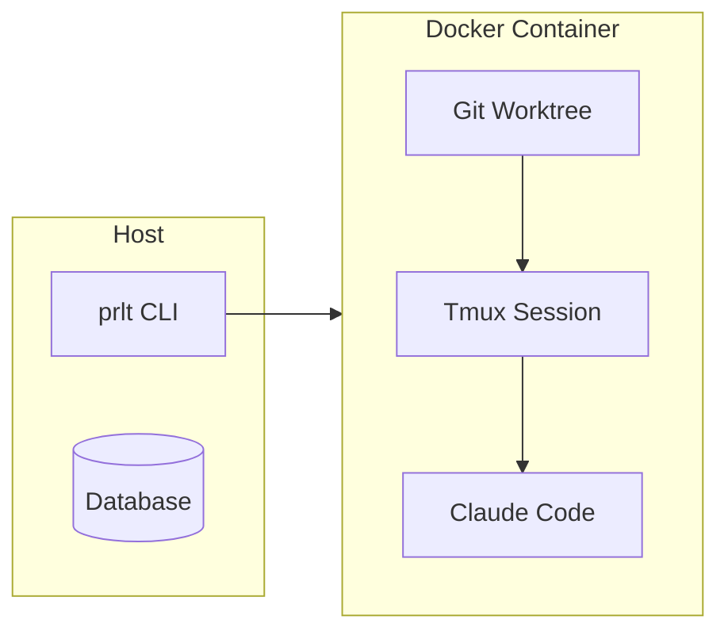
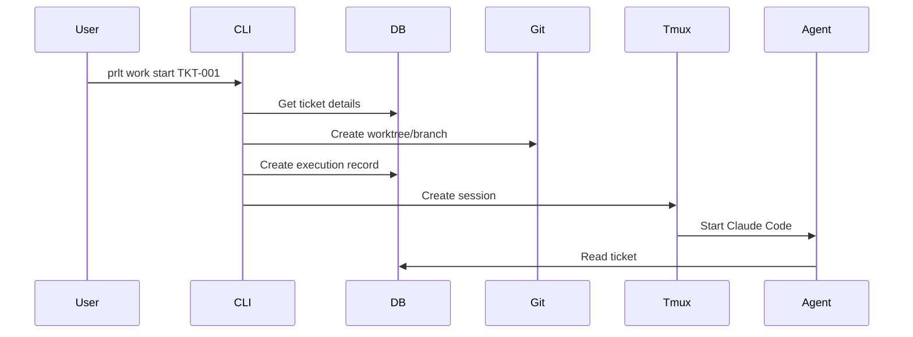
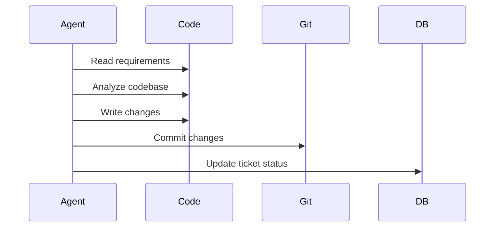
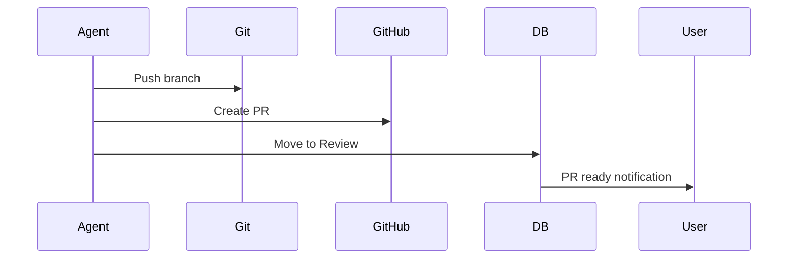

# How It Works

Understanding prlt's architecture helps you use it effectively.

## Overview

prlt orchestrates AI coding agents using:

- **SQLite Database** - Central state management
- **Git Worktrees** - Isolated workspaces per agent
- **Tmux Sessions** - Persistent agent sessions
- **Docker Containers** - Optional sandboxed execution
- **Claude Code** - The AI coding agent

## Flow Diagram



## Components

### 1. Workspace Database

The `.proletariat/workspace.db` SQLite database stores:

- Tickets (requirements, status, priority)
- Agents (staff and temp)
- Executions (running sessions)
- Projects and Epics
- Workflows and Statuses
- Actions (prompt templates)

All state is local - no external services required.

### 2. Git Worktrees

Each agent gets its own git worktree:

```
agents/
├── staff/
│   └── alice/           # Named agent worktree
│       ├── frontend/    # Branch: alice-workspace
│       └── backend/
└── temp/
    └── agent-abc123/    # Ticket agent worktree
        ├── frontend/    # Branch: feat/TKT-001
        └── backend/
```

Benefits:
- Complete isolation between agents
- Each agent has full repo access
- No merge conflicts during work
- Easy cleanup after completion

### 3. Tmux Sessions

Every agent runs in a tmux session:

```
tmux sessions:
├── prlt-bold-bezos      # Agent session
├── prlt-keen-gates      # Agent session
└── prlt-swift-musk      # Agent session
```

Benefits:
- Sessions persist after terminal close
- Attach/detach anytime
- Full terminal output history
- Multiple panes if needed

### 4. Docker Execution

With a `.devcontainer/devcontainer.json`, agents run in containers:



Benefits:
- Full isolation from host system
- Safe YOLO mode execution
- Consistent environment
- Resource limits

### 5. Claude Code Agent

Claude Code is the AI that:
- Reads ticket requirements
- Writes and modifies code
- Runs tests and commands
- Creates commits and PRs
- Updates ticket status

## Execution Flow

### 1. Spawn Agent



### 2. Agent Work



### 3. Complete Work



## State Management

### Ticket States

Tickets flow through workflow statuses:

```
Backlog → In Progress → Review → Done
```

State transitions happen via:
- `prlt work start` - Backlog → In Progress
- `prlt work ready` - In Progress → Review
- `prlt work complete` - Review → Done
- `prlt work revise` - Review → In Progress

### Execution States

```
created → running → completed/failed
```

### Agent States

```
available → working → available
```

## Directory Structure

```
my-project/
├── .proletariat/
│   └── workspace.db         # All state
├── repos/
│   ├── frontend/            # Your repos
│   └── backend/
├── agents/
│   ├── staff/
│   │   └── alice/           # Named agent
│   │       ├── frontend/
│   │       └── backend/
│   └── temp/
│       └── agent-abc123/    # Ticket agent
│           ├── frontend/
│           └── backend/
└── .devcontainer/
    └── devcontainer.json    # Docker config
```

## Resource Management

### Git Branches

Each ticket gets a branch:
```
feat/TKT-001-add-oauth
fix/TKT-002-login-bug
```

### Worktree Cleanup

```bash
# Remove temp agent worktrees
prlt agent cleanup

# Remove specific agent
prlt agent remove <name>
```

### Docker Cleanup

```bash
# Remove stopped containers
prlt docker clean

# Full prune
prlt docker prune
```

## Security Model

### Host Mode

- Agent runs with your user permissions
- Access to full filesystem
- Use Safe mode for prompts

### Docker Mode

- Agent isolated in container
- Only mounted volumes accessible
- YOLO mode is safe

### Credentials

- Claude Code auth: `~/.claude/`
- GitHub auth: `~/.config/gh/` or `GITHUB_TOKEN`

## Performance

### Factors

| Factor | Impact |
|--------|--------|
| Docker vs Host | Host is faster (no container overhead) |
| Concurrent agents | Limited by CPU/RAM |
| Disk speed | Affects git operations |
| Network | PR creation, pushes |

### Recommendations

- Use SSD for workspaces
- Limit concurrent Docker agents to 10-20
- Use background mode for batch spawns
- Clean up regularly

## Next Steps

- [Data Model](/architecture/data-model) - Database schema
- [Agent Isolation](/architecture/agent-isolation) - Isolation details
- [Docker Setup](/guides/docker-setup) - Container configuration
