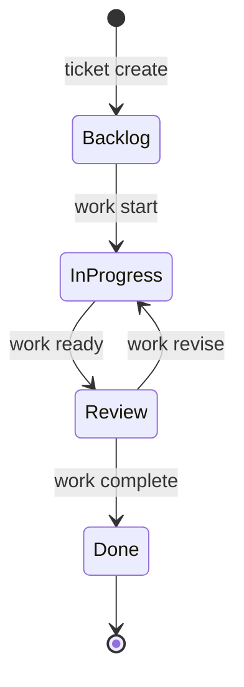

# Creating Tickets

Tickets are the unit of work in prlt. Well-structured tickets help agents understand what to build.

## Creating a Basic Ticket

### Interactive Mode

```bash
prlt ticket create
```

You'll be prompted for:
- Title
- Description
- Priority (P0-P4)
- Category (feature, bug, enhancement, etc.)

### Flag Mode

```bash
prlt ticket create \
  --title "Add user authentication" \
  --description "Implement login/logout with JWT tokens" \
  --priority P1 \
  --category feature
```

## Ticket Fields

| Field | Description | Example |
|-------|-------------|---------|
| **Title** | Brief summary | "Add OAuth login" |
| **Description** | Detailed requirements | "Implement Google and GitHub OAuth..." |
| **Priority** | P0 (critical) to P4 (low) | P1 |
| **Category** | Type of work | feature, bug, enhancement |
| **Acceptance Criteria** | Done conditions | "User can log in with Google" |

## Adding Acceptance Criteria

Acceptance criteria define when work is complete:

```bash
# Add single AC
prlt ticket edit TKT-001 --add-ac "User can log in with Google"
prlt ticket edit TKT-001 --add-ac "User can log in with GitHub"
prlt ticket edit TKT-001 --add-ac "Session persists across page refresh"
```

## Using the Groom Action

Have an agent refine your ticket:

```bash
prlt work start TKT-001 --action groom
```

The agent will:
- Add detailed acceptance criteria
- Break down into subtasks if needed
- Suggest implementation approach
- Add relevant labels

## Bulk Operations

Create multiple tickets efficiently:

```bash
prlt ticket bulk
```

Or from a file:

```bash
prlt ticket bulk --file tickets.json
```

## Linking Tickets

Create relationships between tickets:

```bash
# Ticket A blocks Ticket B
prlt link create TKT-002 --blocks TKT-003

# Tickets are related
prlt link create TKT-001 --relates-to TKT-004
```

## Organizing with Epics

Group related tickets under epics:

```bash
# Create epic
prlt epic create --title "User Authentication System"

# Add tickets to epic
prlt epic ticket EPC-001 --add TKT-001 TKT-002 TKT-003

# View epic progress
prlt epic progress EPC-001
```

## Ticket Lifecycle



## Best Practices

### Good Ticket Titles

```bash
# Good - clear and actionable
"Add Google OAuth login"
"Fix password reset email not sending"
"Improve search performance for large datasets"

# Bad - vague or unclear
"Fix bug"
"Auth stuff"
"Make it faster"
```

### Good Descriptions

Include:
- **Context** - Why is this needed?
- **Requirements** - What should it do?
- **Constraints** - Any limitations?
- **Examples** - Sample inputs/outputs

```markdown
## Context
Users currently can only log in with email/password. Many request OAuth support.

## Requirements
- Add "Login with Google" button to login page
- Add "Login with GitHub" button to login page
- Create or link account if email matches existing user
- Store OAuth tokens securely

## Technical Notes
- Use Passport.js for OAuth
- Store tokens in database, not session
```

### Setting Priority

| Priority | When to Use |
|----------|-------------|
| **P0** | Critical - blocks major functionality |
| **P1** | High - needed for upcoming release |
| **P2** | Medium - important but not urgent |
| **P3** | Low - nice to have |
| **P4** | Backlog - future consideration |

## Viewing Tickets

```bash
# List all tickets
prlt ticket list

# View specific ticket
prlt ticket view TKT-001

# Filter by status
prlt ticket list --status "In Progress"

# Filter by category
prlt ticket list --category bug
```

## Next Steps

- [Spawning Agents](/guides/spawning-agents) - Start agents on your tickets
- [Command Reference: ticket](/commands/ticket/create) - Full ticket command docs
