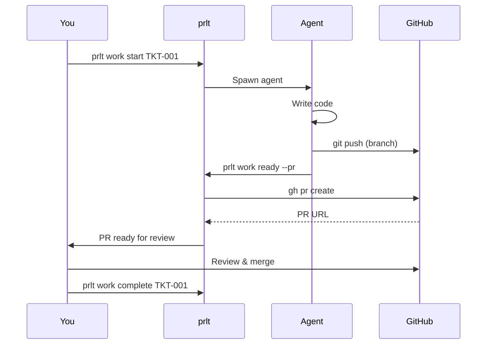

# GitHub Integration

prlt integrates with GitHub for pull request creation and management.

## Setup

### GitHub CLI

Install and authenticate the GitHub CLI:

```bash
# Install (macOS)
brew install gh

# Authenticate
gh auth login
```

### Environment Variable

Or set `GITHUB_TOKEN`:

```bash
export GITHUB_TOKEN=ghp_xxxxxxxxxxxx
```

Add to your shell profile (`~/.bashrc`, `~/.zshrc`):

```bash
export GITHUB_TOKEN=ghp_xxxxxxxxxxxx
```

### Check Status

Verify GitHub integration:

```bash
prlt gh status
```

## Creating Pull Requests

### Automatic PR Creation

When an agent marks work as ready:

```bash
prlt work ready TKT-001 --pr
```

This:
1. Moves ticket to Review status
2. Creates a PR from the agent's branch
3. Links the PR to the ticket

### Manual PR Creation

```bash
prlt pr create TKT-001
```

Or with options:

```bash
prlt pr create TKT-001 \
  --title "Add OAuth login" \
  --body "Implements Google and GitHub OAuth" \
  --base main
```

## PR Templates

PRs are created with ticket context:

```markdown
## Summary
Implements TKT-001: Add user authentication

## Changes
- Added login endpoint
- Added session management
- Added logout functionality

## Acceptance Criteria
- [x] User can log in with email/password
- [x] Session persists across page refresh
- [x] User can log out

## Testing
- Run `npm test` for unit tests
- Manual testing: navigate to /login
```

## Viewing PR Status

```bash
# Check PR for a ticket
prlt pr status TKT-001

# List all PRs
prlt pr list
```

## Linking Existing PRs

Link an existing PR to a ticket:

```bash
prlt pr link TKT-001 https://github.com/org/repo/pull/123
```

## Workflow Integration

### Complete Workflow



### Agent-Driven Workflow

Agents can create PRs directly:

```bash
# In agent's action prompt
prlt work ready TKT-001 --pr
```

## Branch Naming

Branches follow the pattern:

```
feat/TKT-001-add-oauth
fix/TKT-042-login-bug
```

Customize with:

```bash
prlt branch create TKT-001 --prefix feat
```

## Multi-Repo PRs

When working across multiple repos:

```bash
# Each repo gets its own branch
prlt work start TKT-001
# Agent commits to frontend/TKT-001, backend/TKT-001, etc.

# Create PRs for each repo
prlt pr create TKT-001 --repo frontend
prlt pr create TKT-001 --repo backend
```

## PR Reviews

Have an agent review a PR:

```bash
prlt work start TKT-001 --action review
```

The agent will:
- Read the diff
- Check against acceptance criteria
- Suggest improvements
- Leave review comments

## Troubleshooting

### "gh: command not found"

Install GitHub CLI:

```bash
# macOS
brew install gh

# Ubuntu
curl -fsSL https://cli.github.com/packages/githubcli-archive-keyring.gpg | sudo dd of=/usr/share/keyrings/githubcli-archive-keyring.gpg
echo "deb [arch=$(dpkg --print-architecture) signed-by=/usr/share/keyrings/githubcli-archive-keyring.gpg] https://cli.github.com/packages stable main" | sudo tee /etc/apt/sources.list.d/github-cli.list > /dev/null
sudo apt update && sudo apt install gh
```

### "Authentication required"

Re-authenticate:

```bash
gh auth logout
gh auth login
```

Or check token:

```bash
echo $GITHUB_TOKEN
gh auth status
```

### "Remote branch not found"

Push the branch first:

```bash
git push -u origin feat/TKT-001-description
prlt pr create TKT-001
```

## Best Practices

1. **Use descriptive branch names** - Include ticket ID and brief description
2. **Include acceptance criteria in PRs** - Reviewers know what to check
3. **Link PRs to tickets** - Keep everything connected
4. **Use agent review** - Get AI feedback before human review
5. **Set up PR templates** - Consistent PR format

## Next Steps

- [Multi-Agent Workflows](/guides/multi-agent-workflows) - Parallel development
- [Command Reference: pr](/commands/other/pr) - Full PR command docs
- [Command Reference: gh](/commands/other/gh) - GitHub CLI integration
