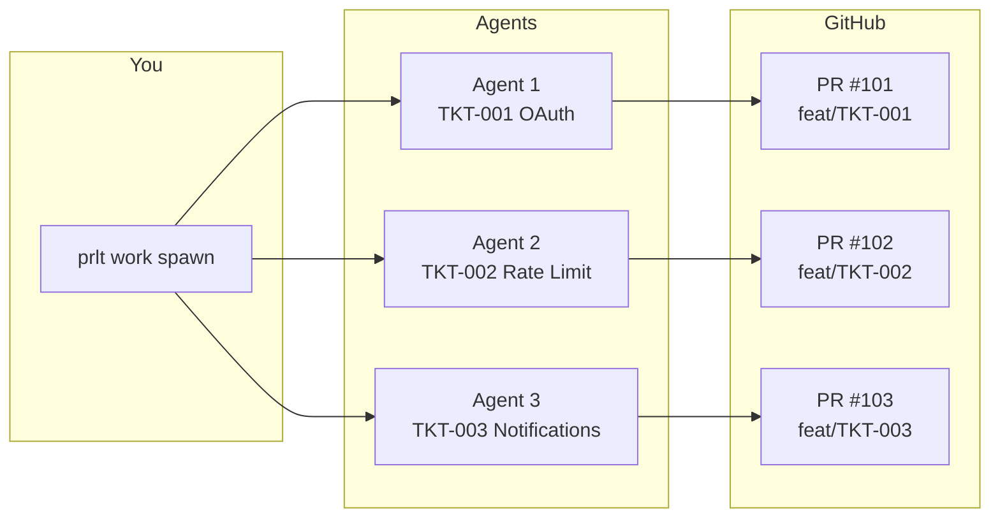

# Multi-Agent Workflows

Scale your development with multiple concurrent agents.

## Parallel Development

### Spawn Multiple Tickets

Select and spawn multiple tickets:

```bash
prlt work spawn
# Select multiple tickets in the menu
```

Or specify directly:

```bash
prlt work spawn TKT-001 TKT-002 TKT-003
```

### Architecture

Each agent gets complete isolation:



### Workspace Isolation

Each agent works in its own directory:

```
agents/
└── temp/
    ├── agent-abc123/     # TKT-001
    │   ├── frontend/     # Branch: feat/TKT-001
    │   └── backend/
    ├── agent-def456/     # TKT-002
    │   ├── frontend/     # Branch: feat/TKT-002
    │   └── backend/
    └── agent-ghi789/     # TKT-003
        ├── frontend/     # Branch: feat/TKT-003
        └── backend/
```

## Batch Operations

### Spawn All in Column

```bash
# Spawn all tickets in Backlog
prlt work spawn --all --column Backlog
```

### Spawn by Category

```bash
# Spawn all bugs
prlt work spawn --all --category bug

# Spawn all features
prlt work spawn --all --category feature
```

### Spawn by Priority

```bash
# Spawn high-priority tickets
prlt work spawn --all --priority P0 P1
```

## Monitoring Multiple Agents

### Execution List

```bash
prlt execution list
```

Output:
```
┌──────────┬────────────────┬───────────┬──────────┬──────────────────┐
│ ID       │ Agent          │ Ticket    │ Status   │ Started          │
├──────────┼────────────────┼───────────┼──────────┼──────────────────┤
│ exec-001 │ bold-bezos     │ TKT-001   │ running  │ 5 minutes ago    │
│ exec-002 │ keen-gates     │ TKT-002   │ running  │ 3 minutes ago    │
│ exec-003 │ swift-musk     │ TKT-003   │ running  │ 2 minutes ago    │
│ exec-004 │ quick-zuck     │ TKT-004   │ running  │ 1 minute ago     │
└──────────┴────────────────┴───────────┴──────────┴──────────────────┘
```

### Board Watch

Real-time updates across all agents:

```bash
prlt board watch
```

### Individual Logs

```bash
# View specific agent output
prlt execution logs exec-001

# Follow logs
prlt execution logs exec-001 --follow
```

## Coordination Strategies

### Independent Tasks

Best for unrelated work:

```bash
# Different features, different areas
prlt work spawn TKT-001 TKT-002 TKT-003
# Each works independently, no conflicts
```

### Sequential Dependencies

Use ticket links:

```bash
# TKT-002 depends on TKT-001
prlt link create TKT-001 --blocks TKT-002

# Spawn blocker first
prlt work start TKT-001
# When complete, spawn dependent
prlt work start TKT-002
```

### Shared Component Work

Split across boundaries:

```bash
# Frontend agent
prlt work start TKT-001 --agent frontend-dev

# Backend agent (different repo scope)
prlt work start TKT-002 --agent backend-dev
```

## Scaling Considerations

### Resource Limits

| Mode | Recommended Max | Limiting Factor |
|------|-----------------|-----------------|
| Docker | 10-20 | Container memory |
| Host | 20-50 | CPU, file handles |

### Optimization Tips

1. **Use background mode** - Reduces terminal overhead
2. **Stagger spawns** - Don't start 50 at once
3. **Close completed sessions** - Free resources
4. **Use SSD** - Faster git operations

### Memory Management

```bash
# Check Docker resources
docker stats

# Clean up when done
prlt docker clean
prlt agent cleanup
```

## Workflow Patterns

### Bug Bash

Tackle many bugs in parallel:

```bash
# Create bug tickets
prlt ticket create --title "Fix login timeout" --category bug
prlt ticket create --title "Fix password validation" --category bug
prlt ticket create --title "Fix session expiry" --category bug

# Spawn all bugs
prlt work spawn --all --category bug --skip-permissions
```

### Feature Sprint

Parallel feature development:

```bash
# Create feature tickets
prlt epic create --title "User Dashboard"
prlt epic ticket EPC-001 --create "Add user profile" --category feature
prlt epic ticket EPC-001 --create "Add activity feed" --category feature
prlt epic ticket EPC-001 --create "Add notifications" --category feature

# Spawn epic tickets
prlt work spawn --epic EPC-001
```

### Code Review Pipeline

Have agents review each other's work:

```bash
# Developer agents create PRs
prlt work spawn TKT-001 TKT-002 TKT-003

# Review agent reviews completed work
prlt work start TKT-001 --action review --agent reviewer
```

## Watching Progress

### Column Watch

Auto-spawn when tickets enter a column:

```bash
prlt work watch --column "To Do" --action implement
```

### Priority Watch

Auto-spawn high-priority tickets:

```bash
prlt work watch --priority P0 P1 --action implement
```

## Troubleshooting

### Agents Conflicting

Each agent has its own branch, so direct conflicts are rare. If you see issues:

1. Check branch names: `git branch -a`
2. Verify agents are on different tickets
3. Check for shared files being modified

### Too Many Open Files

```bash
# Increase limit temporarily
ulimit -n 4096

# Or reduce concurrent agents
prlt execution stop --some
```

### Containers Slow

```bash
# Check resource usage
docker stats

# Prune unused resources
docker system prune
```

## Best Practices

1. **Start small** - Test with 2-3 agents first
2. **Use Docker** - Isolation prevents issues
3. **Monitor actively** - Watch board and executions
4. **Clean up regularly** - Free resources after completion
5. **Review PRs promptly** - Don't let them pile up

## Next Steps

- [Actions Guide](/guides/actions) - Custom agent actions
- [Architecture](/architecture/how-it-works) - How it all works
- [Troubleshooting](/reference/troubleshooting) - Common issues
