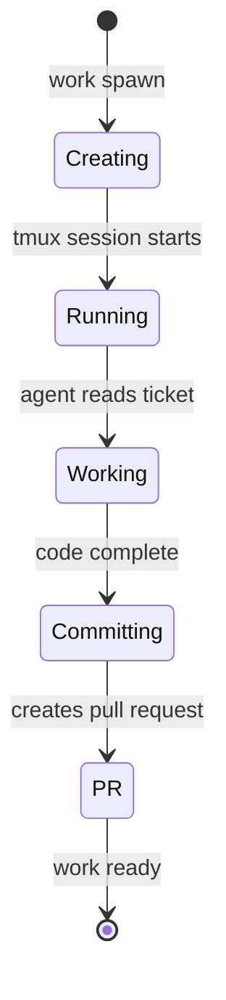

# Spawning Agents

Learn how to spawn, manage, and monitor AI coding agents.

## Starting a Single Agent

### Interactive Mode

```bash
prlt work spawn
```

This guides you through selecting:
1. Project
2. Tickets to work on
3. Execution environment (Docker/Host)
4. Action (implement, groom, review)
5. Display mode (Terminal/Background)

### Direct Mode

```bash
prlt work start TKT-001
```

With options:

```bash
prlt work start TKT-001 \
  --action implement \
  --display background \
  --skip-permissions
```

## Spawning Multiple Agents

### Interactive Selection

```bash
prlt work spawn
# Select multiple tickets in the menu
```

### Batch Spawn

Spawn specific tickets:

```bash
prlt work spawn TKT-001 TKT-002 TKT-003
```

Spawn all tickets in a column:

```bash
prlt work spawn --all --column Backlog
```

Spawn by category:

```bash
prlt work spawn --all --category bug
```

## Execution Environments

### Docker (Recommended)

Runs agents in isolated containers:

```bash
prlt work start TKT-001  # Default if devcontainer exists
```

Benefits:
- Full isolation from your system
- Safe to use YOLO mode (no permission prompts)
- Consistent environment across agents

Requirements:
- Docker installed and running
- `.devcontainer/` in your repo

### Host

Runs agents directly on your machine:

```bash
prlt work start TKT-001 --run-on-host
```

Benefits:
- Faster startup (no container overhead)
- Direct access to system tools

Cautions:
- Agents can access your filesystem
- Use "Safe" permission mode

## Display Modes

### Terminal

Opens in a new terminal tab:

```bash
prlt work start TKT-001 --display terminal
```

- Watch agent work in real-time
- Close window safely - session persists in tmux

### Background

Runs detached:

```bash
prlt work start TKT-001 --display background
```

- Agent works silently
- Attach later with `prlt session attach`
- Good for batch spawning

## Permission Modes

### Safe Mode (Default)

Agent prompts before destructive actions:

```bash
prlt work start TKT-001
```

### YOLO Mode

Full autonomy, no prompts:

```bash
prlt work start TKT-001 --skip-permissions
```

:::caution
Only use YOLO mode with Docker for safety!
:::

## Actions

### implement (Default)

Agent writes code to fulfill ticket requirements:

```bash
prlt work start TKT-001 --action implement
```

### groom

Agent refines ticket details:

```bash
prlt work start TKT-001 --action groom
```

Adds:
- Acceptance criteria
- Subtasks
- Implementation suggestions
- Estimates

### review

Agent reviews existing code:

```bash
prlt work start TKT-001 --action review
```

## Monitoring Agents

### List Running Executions

```bash
prlt execution list
```

Output:
```
┌─────────┬────────────┬───────────────┬──────────┐
│ ID      │ Agent      │ Ticket        │ Status   │
├─────────┼────────────┼───────────────┼──────────┤
│ exec-01 │ bold-bezos │ TKT-001       │ running  │
│ exec-02 │ keen-gates │ TKT-002       │ running  │
└─────────┴────────────┴───────────────┴──────────┘
```

### View Agent Logs

```bash
prlt execution logs exec-01
```

### Watch the Board

Real-time board updates:

```bash
prlt board watch
```

### Attach to Session

```bash
prlt session list
prlt session attach bold-bezos
```

## Agent Lifecycle



## Staff vs Temp Agents

### Staff Agents

Persistent named agents:

```bash
# Add staff agents
prlt staff add alice bob charlie

# Use specific agent
prlt work start TKT-001 --agent alice

# List staff
prlt staff list
```

### Temp Agents

Ephemeral per-ticket agents:

```bash
# Spawns new temp agent
prlt work spawn TKT-001

# List temp agents
prlt agent list --temp

# Cleanup old temp agents
prlt agent cleanup
```

## Parallel Agent Scaling

Run many agents simultaneously:

```bash
# Spawn all backlog tickets
prlt work spawn --all --column Backlog

# With Docker isolation
prlt work spawn TKT-001 TKT-002 TKT-003 --skip-permissions
```

Each agent:
- Gets its own git branch
- Works in isolated workspace
- Creates separate PR

:::tip
50+ concurrent agents is achievable depending on CPU, RAM, and Docker/host mode.
:::

## Stopping Agents

```bash
# Stop specific execution
prlt execution stop exec-01

# Stop all executions
prlt execution stop --all
```

## Best Practices

1. **Use Docker for isolation** - Especially with YOLO mode
2. **Start with Safe mode** - Until you trust the workflow
3. **Use background for batch** - Terminal gets crowded
4. **Monitor with board watch** - See all agents at once
5. **Clean up temp agents** - Free disk space regularly

## Next Steps

- [Docker Setup](/guides/docker-setup) - Container configuration
- [Multi-Agent Workflows](/guides/multi-agent-workflows) - Advanced patterns
- [Command Reference: work](/commands/work/start) - Full work command docs
