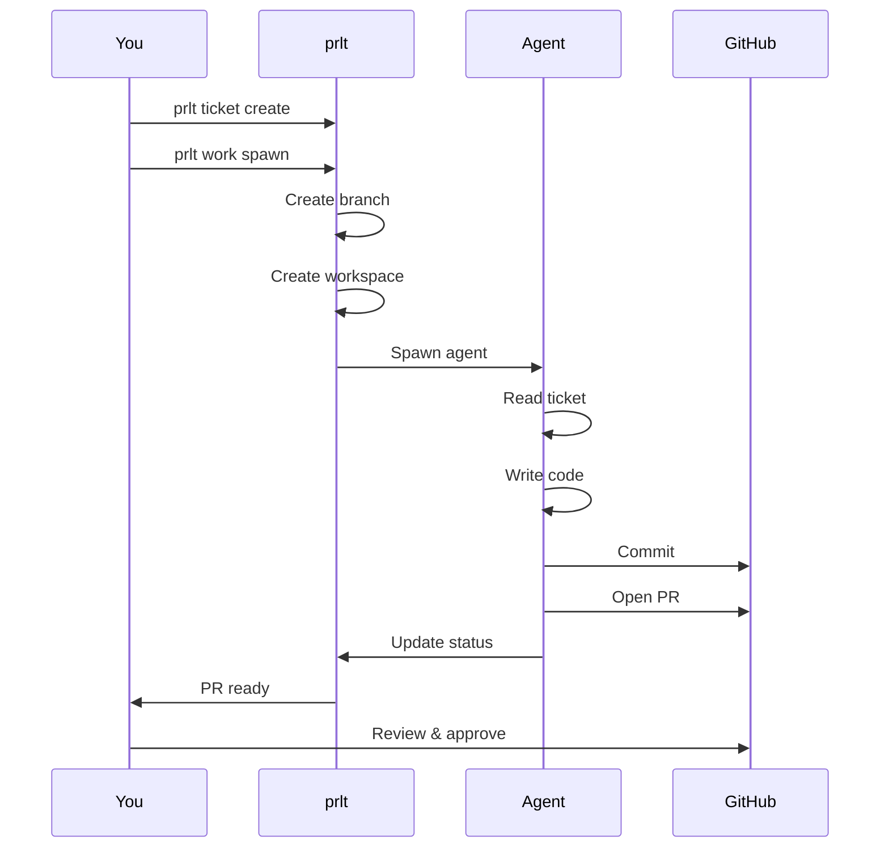

# prlt

**Agent orchestration platform for AI labor.** Spin up workers for all work, on demand.

> Themed agents, including billionaires - Finally, they work for us.

## What is prlt?

prlt is an agent orchestration platform that lets you spawn, coordinate, and manage multiple AI coding agents from a single CLI. Each agent works in isolation on its own git branch, writes code, and opens pull requests for you to review and merge.

## Key Features

- **Isolated** - Each agent gets its own git branch. No conflicts.
- **Secure** - Docker containers, sandboxed from your host.
- **Durable** - Tmux sessions persist. Close window, agent keeps working.
- **Trackable** - One database, one CLI, all your agents.
- **Ephemeral** - Spawn agents on demand. They work, they PR, they're done.
- **Structured** - Tickets provide structured context, not freeform chat.
- **Persistent** - Tickets accumulate context over time. Hand off between agents.
- **Agent-native** - `--json` mode lets AI agents drive the CLI programmatically.

## Quick Example

```bash
npm install -g @proletariat/cli    # Install
prlt init                          # Create HQ, add repos, choose theme
prlt ticket create --title "Add OAuth" --category feature
prlt work spawn                    # Interactive: select tickets, environment, action
# Agent creates PR → You review → Merge → Done
```

## How It Works



## Next Steps

- [Installation](/getting-started/installation) - Get prlt installed
- [Quick Start](/getting-started/quick-start) - Create your first agent workflow
- [Core Concepts](/getting-started/core-concepts) - Understand the mental model
- [Command Reference](/commands) - Full CLI documentation
